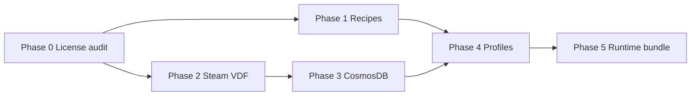

# Open Source Adoption Plan

Phased plan for incorporating the highest-value MIT-friendly (and carefully
scoped GPL/reference) projects into Cosmos. This extends
[OPEN_SOURCE_INTEGRATIONS.md](OPEN_SOURCE_INTEGRATIONS.md) and aligns with
milestone **0.7 (CosmosDB)** and **1.0 (Cosmos Runtime)** in
[ROADMAP.md](ROADMAP.md).

## Current baseline

| Area | Status today | Gap |
| --- | --- | --- |
| Repair / recipes | 3 dependency + 13 fix `.recipe` files; winetricks external | Small catalog; no registry-diff tooling; Cellar cited only in docs |
| Steam detection | Bash/awk VDF + ACF in `scripts/lib/steam_lib.sh` | Wine-prefix only; heuristic parser; no native macOS Steam path |
| CosmosDB | ProtonDB + AGW + MacGamingDB + local reports | No community GitHub DB; no UMU API; no profile auto-update |
| Profiles | 21 hand-curated `profiles/steam/*.yaml` | Thin vs ProtonDB breadth; no seeded presets from macos-wine-steam |
| Runtime | Gcenx Wine + DXMT v0.74 download at runtime | No bundled stack; DXVK manual; no versioned Cosmos Runtime |

Cosmos is **bash-first** with a SwiftUI dashboard. Prefer integrations that
fit shell scripts + optional Python helpers until a native helper binary (1.0)
justifies Rust crates.

---

## Guiding rules

1. **MIT (or permissive) in-tree** — vendor, diff, or translate into Cosmos
   recipes/profiles. See [LICENSING.md](LICENSING.md).
2. **GPL reference-only** — read fix ideas from protonfixes / umu-protonfixes;
   reimplement as YAML recipes and `.recipe` files. Never copy Python fix scripts
   into the MIT repo.
3. **API-at-runtime OK** — UMU API, ProtonDB, MacGamingDB: fetch hints, cache
   locally, translate into Cosmos-native metadata. No bulk script import.
4. **Unclear license = watch, don't import** — cellar-memory has no LICENSE file;
   confirm before any data merge.
5. **Smallest correct diff** — extend existing libs (`recipe_lib.sh`,
   `steam_lib.sh`, `cosmosdb_lib.sh`) before adding new runtimes.

---

## Phase 0 — License audit (prerequisite)

Complete before importing data or vendoring new trees.

| Project | Action | Owner |
| --- | --- | --- |
| [neo773/macgamingdb](https://github.com/neo773/macgamingdb) | Confirm MIT in repo; document in LICENSING.md | Docs |
| [cellar-memory](https://github.com/lasermaze/cellar-memory) | Find or request LICENSE; block data import until clear | Legal watch |
| [winemactricks-json](https://github.com/...) | Confirm MIT; note attribution in `recipes/dependencies/README.md` | Docs |
| [wineregdiff](https://github.com/...) | Confirm MIT | Docs |
| UMU API data repo | GPL-3.0 — runtime API only, no bulk copy | Policy doc |
| DXMT ≥ v0.80 | LGPL trap — stay pinned at v0.74 until bundle strategy decided | Already in LICENSING.md |

**Exit criteria:** `docs/LICENSING.md` updated with every new upstream; no
imports from projects without a verified SPDX identifier.

---

## Phase 1 — Repair / recipes layer

**Milestone fit:** strengthens completed **0.5**; feeds **0.7** profile repairs
and **1.0** bundled registry defaults.

### 1a. winemactricks-json (MIT) — highest priority

**Why:** JSON tweak DB for macOS Wine (VC++ overrides, registry patches). Same
mental model as winetricks verbs, Mac-oriented. Natural fit for `recipes/`.

**Integration plan:**

```
third_party/winemactricks-json/     # vendored JSON (or git submodule)
        │
        ▼
scripts/import_winemactricks.sh     # one-time / CI sync → Cosmos recipes
        │
        ├── recipes/dependencies/   # new .recipe files (winetricks verbs)
        └── recipes/fixes/          # registry_patch, dll_override entries
```

**Tasks:**

- [x] Vendor JSON under `third_party/winemactricks-json/` with LICENSE + README
  pointing at upstream.
- [x] Add `scripts/import_winemactricks.sh` to map JSON entries → `.recipe`
  files (idempotent; skip duplicates).
- [x] Extend `recipe_lib.sh` for `DLL_OVERRIDE`, `SOURCE`, `REG_COMMANDS`.
- [x] Wire high-frequency deps (`vcrun2019`, `dotnet48`, `corefonts`) into
  `repair.command diagnose` missing-runtime hints.
- [x] Dashboard: surface new deps in Repair & Dependencies (no UI change if
  `list-deps` auto-discovers).

**Success:** Dependency catalog grows from 3 → 15+ Mac-relevant entries without
bundling winetricks.

### 1b. wineregdiff (MIT)

**Why:** Diff two `user.reg` files → `wine reg add` commands. Records profile
fixes and generates repair recipes from a working bottle.

**Integration plan:**

```
repair.command capture-reg <label>     # snapshot user.reg to CosmosDB dir
repair.command diff-reg <a> <b>        # emit reg commands + optional .recipe
repair.command recipe-from-diff <a> <b> # write recipes/fixes/custom-<slug>.recipe
```

**Tasks:**

- [ ] Add `third_party/wineregdiff/` or thin Python dependency (MIT) invoked
  from `scripts/lib/regdiff_lib.sh`.
- [ ] New fix recipe type `apply_reg_script` (lines of `wine reg add` / `reg delete`).
- [ ] Document workflow in `recipes/fixes/README.md`: "fix on working Mac →
  diff → commit recipe."
- [ ] Optional: `profile.command export-reg` after `apply` for regression capture.

**Success:** Contributors can turn a one-off registry fix into a shareable recipe
in one command.

### 1c. Cellar (MIT) — reference mining only

**Why:** AI-driven retro-game Wine config; Cosmos already aligns fix categories
with Cellar/D4Mac docs. Mine **fallback recipes**, not Swift UI.

**Tasks:**

- [ ] Audit [Cellar](https://github.com/lasermaze/Cellar) config/repair data
  (JSON/YAML if present) against `scripts/repair_diagnose.sh` categories.
- [ ] Crosswalk table in `docs/OPEN_SOURCE_INTEGRATIONS.md`: Cellar category →
  Cosmos `recipes/fixes/*` id.
- [ ] Port missing categories (e.g. shader cache clear, specific env toggles) as
  new `.recipe` files with attribution notes.
- [ ] Do **not** import Cellar Swift app code.

### 1d. cellar-memory — watch only

**Why:** Shared wiki of successful configs. High value if license clears.

**Tasks:**

- [ ] Track upstream for LICENSE addition.
- [ ] If MIT: design import as CosmosDB **external hint** (like MacGamingDB), not
  raw file vendoring.
- [ ] Until then: manual spot-check only.

**Phase 1 exit criteria:** 25+ recipes; `recipe-from-diff` workflow documented;
Cellar crosswalk published.

---

## Phase 2 — Steam detection / VDF parsing

**Milestone fit:** hardens **0.2** detection; enables dual-path scan for **0.7**
library UI and **1.0** runtime.

Cosmos scans Steam **inside the Wine prefix**, not native
`~/Library/Application Support/Steam`. These libs still help for validation,
secondary-library edge cases, and future native-Steam discovery.

### Recommended approach: layered, not rewrite

Keep `steam_lib.sh` as the hot path (no new runtime dep for default users). Add
**optional verify backends** and a **dual-path** mode.

| Project | License | Phase 2 role |
| --- | --- | --- |
| [ValvePython/vdf](https://github.com/ValvePython/vdf) | MIT | Python verify parser in CI + `--verify-python` |
| [steam-locate](https://github.com/...) | MIT | Native macOS Steam root discovery |
| [steam-path](https://github.com/...) | MIT | `getLibraryFolders`, `getAppManifest` for cross-check |
| [@node-steam/vdf](https://www.npmjs.com/package/@node-steam/vdf) | MIT | Defer until Tauri/Node UI (see ARCHITECTURE.md) |
| [steamlocate-rs](https://github.com/...) | MIT | **1.0** native helper binary, not Phase 2 |

**Tasks:**

- [ ] Add `scripts/verify_vdf_python.sh` using ValvePython/vdf; run in CI
  alongside `test_steam_detection.sh` on fixture prefixes.
- [ ] Extend `detect_steam_games.command` with `COSMOS_STEAM_NATIVE_SCAN=1`:
  merge native Steam libraries with Wine-prefix libraries (dedupe by App ID).
- [ ] Implement `steam_native_paths()` in `steam_lib.sh` calling `steam-locate`
  or steam-path via small Python/Node shim (user-opt-in).
- [ ] Document dual-path semantics in `docs/STEAM_SETUP.md`.
- [ ] Keep `COSMOS_VERIFY_NODE=1` + find-steam-app as optional cross-check
  (already integrated).

**Defer:** steamlocate-rs until Cosmos Runtime ships a signed helper binary.

**Phase 2 exit criteria:** CI proves bash parser matches ValvePython/vdf on all
fixtures; optional native Steam path documented and tested.

---

## Phase 3 — Compatibility DB (CosmosDB 0.7 → 1.0)

**Milestone fit:** completes roadmap **0.7**; feeds profile auto-update for **1.0**.

### 3a. Already integrated — deepen

| Source | Status | Next step |
| --- | --- | --- |
| [Trsnaqe/protondb-community-api](https://github.com/Trsnaqe/protondb-community-api) | MIT; in `cosmosdb_lib.sh` | Map ProtonDB `tier` → suggested `status` in profiles |
| [neo773/macgamingdb](https://github.com/neo773/macgamingdb) | REST consumed; verify MIT | Use repo schema for GitHub-hosted `cosmos-db/` JSON layout |
| AppleGamingWiki | MediaWiki parse | Keep hint-only; attribute CC BY-SA in UI |

### 3b. UMU API (GPL-3.0 data) — runtime only

**Why:** Map Steam App ID → fix metadata (deps, env vars, proton paths).

**Tasks:**

- [ ] Add `cosmosdb.command lookup <appid> umu` in `cosmosdb_lib.sh`.
- [ ] Normalize UMU fix hints → Cosmos recipe IDs + profile fields (same as
  diagnose suggester).
- [ ] **Do not** vendor UMU fix scripts; translate ideas into
  `recipes/` + `profiles/`.
- [ ] Cache 24h; document GPL data attribution in LICENSING.md.

### 3c. GitHub-hosted community DB (0.7 blocker)

**Tasks:**

- [ ] Create `cosmos-db/` directory schema (JSON per appid or SQLite export).
- [ ] Borrow field names from macgamingdb + local `cosmosdb-report-v0`.
- [ ] `cosmosdb.command sync` to pull community reports.
- [ ] Dashboard badges + one-click "Apply community profile" (roadmap 0.7).

**Phase 3 exit criteria:** UMU lookup live; community DB sync; dashboard shows
badges at point-of-use.

---

## Phase 4 — Profiles / "Proton for Mac" content

**Milestone fit:** scales profiles from 21 → 100+ for **1.0**.

### 4a. macos-wine-steam (MIT) — safe merge

**Why:** Per-game presets in `cosmos_configs/`; direct Cosmos lineage.

**Tasks:**

- [ ] Script `scripts/import_macos_wine_steam.sh` to diff upstream
  `cosmos_configs/` against ours; emit YAML profile drafts.
- [ ] Merge non-conflicting `*.conf` env patterns into `profiles/steam/*.yaml`
  `settings.env` blocks.
- [ ] Track upstream periodically (quarterly or on release tags).

### 4b. winemactricks-json → profiles

**Tasks:**

- [ ] For each imported dependency recipe, add optional `dependencies:` entries
  to matching profiles (by App ID lists in JSON if present).
- [ ] `profile.command validate` must pass after bulk seed.

### 4c. protonfixes / umu-protonfixes (GPL-3.0) — reference porting

**Why:** Rich per-title fix corpus for Linux Proton; concepts port to macOS.

**Workflow (no GPL code in tree):**

```
1. Read protonfixes/gamefix/*.py or umu-protonfixes equivalent
2. Extract: winetricks verbs, WINEDLLOVERRIDES, env vars, exe swap ideas
3. Reimplement as profiles/steam/*.yaml + recipes/fixes/*.recipe
4. Note "Ported from protonfixes idea" in profile notes (not copied code)
```

**Tasks:**

- [ ] Add `docs/PROTONFIXES_PORTING.md` with the workflow above.
- [ ] Pilot: port 5 high-traffic ProtonDB titles already in Cosmos profiles.
- [ ] Link `cosmosdb.command lookup` → "suggest profile draft" (human review PR).

**Phase 4 exit criteria:** 50+ validated profiles; porting guide; automated
draft generation from macos-wine-steam diff.

---

## Phase 5 — Runtime / graphics (1.0 bundle)

**Milestone fit:** **1.0 Cosmos Runtime** only. Several deps are permissive but
not MIT — document notices.

| Component | License | 1.0 action |
| --- | --- | --- |
| [Gcenx/macOS_Wine_builds](https://github.com/Gcenx/macOS_Wine_builds) | Wine upstream terms | Pin version; bundle in Cosmos Runtime tarball |
| DXMT ≤ v0.74 | MIT | Keep pin; bundle with license file |
| DXMT ≥ v0.80 | LGPL | Do not upgrade without LGPL compliance plan |
| [Gcenx/DXVK-macOS](https://github.com/Gcenx/DXVK-macOS) | Zlib | Auto-download when `COSMOS_BACKEND=dxvk` experimental |
| [MoltenVK](https://github.com/KhronosGroup/MoltenVK) | Apache-2.0 | Bundle as DXVK backend dep; NOTICE file |
| Winetricks | LGPL | Continue external invoke; optional bundle later |

**Tasks:**

- [ ] `run.command` / Runtime manifest: `cosmos-runtime.json` pins Wine, DXMT,
  MoltenVK, DXVK-macOS versions and checksums.
- [ ] Experimental `COSMOS_AUTO_DXVK=1` downloads DXVK-macOS + MoltenVK to
  `~/Library/Application Support/Cosmos/Runtime/`.
- [ ] Offline installer build (`scripts/build_dmg.command`) embeds pinned MIT stack.
- [ ] LGPL gate in CI: fail if `DXMT_VERSION` > 0.80 without `COSMOS_ALLOW_LGPL=1`.

**Phase 5 exit criteria:** Single downloadable Cosmos Runtime; backend auto-fetch
for DXVK path; license notices in app bundle.

---

## Priority matrix

| Priority | Project | Effort | Milestone | License risk |
| --- | --- | --- | --- | --- |
| P0 | License audits | Low | Immediate | — |
| P1 | winemactricks-json | Medium | 0.7 | Low (MIT) |
| P1 | wineregdiff | Medium | 0.7 | Low (MIT) |
| P2 | ValvePython/vdf verify | Low | 0.7 | Low (MIT) |
| P2 | steam-locate dual-path | Medium | 0.7 | Low (MIT) |
| P2 | UMU API runtime | Medium | 0.7 | Medium (GPL data) |
| P2 | macos-wine-steam profile seed | Medium | 0.7–1.0 | Low (MIT) |
| P3 | Cellar recipe mining | Low | 0.7 | Low (MIT) |
| P3 | protonfixes porting workflow | Ongoing | 1.0 | Low (reference) |
| P3 | CosmosDB GitHub community DB | High | 0.7 | Low |
| P4 | steamlocate-rs helper | Medium | 1.0 | Low (MIT) |
| P4 | DXVK-macOS auto-fetch | Medium | 1.0 | Low (Zlib) |
| — | cellar-memory | — | Watch | **Blocked** |
| — | @node-steam/vdf | — | Defer Tauri | Low (MIT) |

---

## Suggested build order

Aligns with [ROADMAP.md](ROADMAP.md) build order and closes the **0.7** gap before
**1.0** runtime bundling.



1. **Now (0.7):** Phase 0 + Phase 1a/1b + Phase 2 verify + Phase 3c community DB
2. **Next (0.7 tail):** Phase 3b UMU + Phase 4a macos-wine-steam seed + dashboard badges
3. **1.0:** Phase 5 bundle + Phase 4c protonfixes porting at scale + steamlocate-rs

---

## Tracking

Use GitHub issues/PRs with labels:

| Label | Scope |
| --- | --- |
| `adopt/winemactricks` | JSON → recipes import |
| `adopt/regdiff` | wineregdiff tooling |
| `adopt/steam-vdf` | VDF parser / dual-path |
| `adopt/cosmosdb` | UMU, community DB, badges |
| `adopt/profiles` | macos-wine-steam, protonfixes ports |
| `adopt/runtime-1.0` | Bundled Wine/DXMT/DXVK |

Update this doc when a phase completes or upstream licenses change.

## Related docs

- [OPEN_SOURCE_INTEGRATIONS.md](OPEN_SOURCE_INTEGRATIONS.md) — what is integrated today
- [COSMOSDB.md](COSMOSDB.md) — hint schemas and CLI
- [LICENSING.md](LICENSING.md) — bundle and API policy
- [PROFILE_FORMAT.md](PROFILE_FORMAT.md) — YAML v0 schema
- [PROTON_GAP_ANALYSIS.md](PROTON_GAP_ANALYSIS.md) — Proton parity targets
