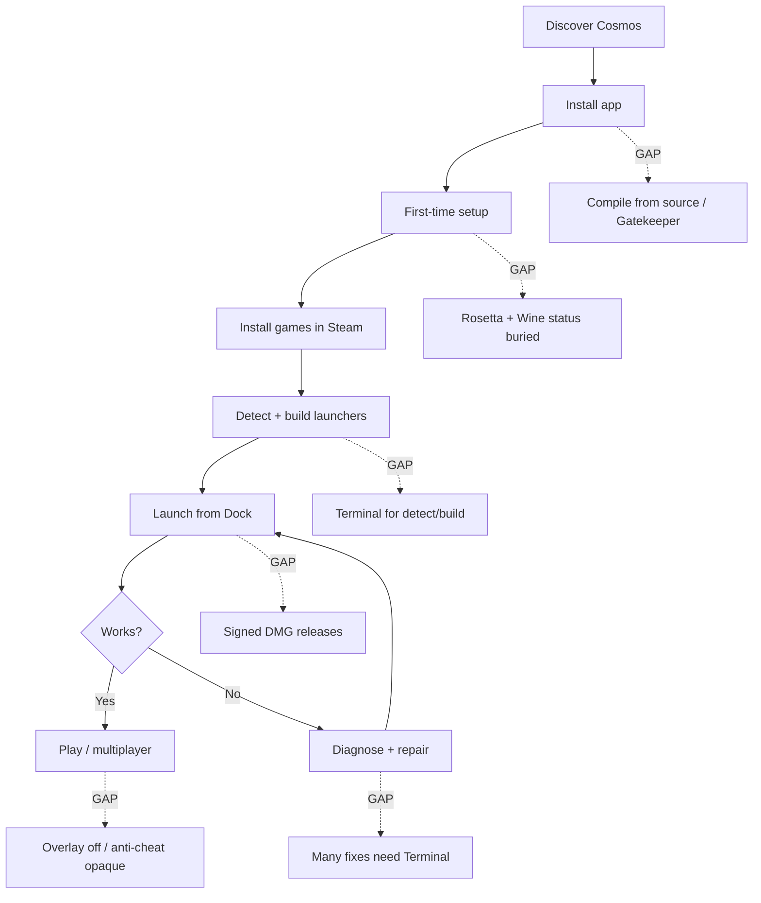

# Cosmos User Gaps Plan

A user-facing gap analysis and prioritized plan for closing the distance between
**what macOS gamers expect** (Proton-like “click Play”) and **what Cosmos delivers
today**. This complements [ROADMAP.md](ROADMAP.md) (engineering milestones) and
[PROTON_GAP_ANALYSIS.md](PROTON_GAP_ANALYSIS.md) (technical comparison).

**Last reviewed:** 2026-06-14 · **Baseline:** `main` (Phases A–E shipped; Phase F in progress; post-0.7 polish on launch/errors/Intel)

---

## Executive summary

Cosmos already has the **Proton-shaped skeleton**: bottles, backends, YAML
profiles, repair recipes, CosmosDB lookups, `.app` launchers, and a SwiftUI
dashboard. Users who complete setup can launch Windows Steam games from the Dock.

The remaining gaps are mostly **depth, discoverability, and distribution** —
not missing plumbing. Users feel friction in four places:

1. **Getting started** — compile the app, Terminal for `sudo`; Rosetta is step 1 on Apple Silicon (Intel skips it).
2. **Knowing before they buy/launch** — compatibility badges and anti-cheat warnings exist but are not prominent in the game library.
3. **When something breaks** — diagnose is strong; in-app one-click repair still routes through Terminal for many actions.
4. **Online / multiplayer expectations** — co-op tags and blocked titles ship; overlay remains off by design.

Structural limits (anti-cheat runtime, Steam overlay, CPU translation on Apple
Silicon) cannot be fully closed; the plan focuses on **honest UX** and **tractable
engineering**.

---

## User journeys (happy path vs gaps)

| Stage | User expectation | Today | Gap severity |
| --- | --- | --- | --- |
| **Discover** | “Works like Proton on Mac” | README accurate but long; no single “will my game work?” page | Medium |
| **Install** | Double-click DMG, drag to Applications | `build_cosmos_app.command` + unsigned/ad-hoc DMG optional | **High** |
| **Setup** | One guided flow, no Terminal | 4-step assistant; Terminal for Wine/Steam/sudo | **High** |
| **Rosetta** | Automatic on Apple Silicon | Dashboard step 1 + Install Rosetta button; Terminal for `sudo` | Low |
| **Library** | See Playable / Blocked before launch | Sidebar badges + blocked pre-launch dialog | Low |
| **Launch** | Click game icon, play | `.app` launchers work; backend/profile often manual | Low |
| **Multiplayer** | Co-op / online “just works” | Works for many titles; overlay disabled; blocked titles labeled | Medium |
| **Fix failure** | One-click suggested fixes | Diagnose + Apply Suggested; some fixes need env vars | Medium |
| **Updates** | App + runtime auto-update | Manual re-clone / rebuild | Medium |
| **Non-Steam** | Same experience as Steam | itch/Battle.net/Epic experimental | Low–Medium |

---

## Gap inventory by theme

### 1. Distribution and trust (highest user-facing friction)

| Gap | User impact | Status | Plan |
| --- | --- | --- | --- |
| No notarized Developer ID build | Gatekeeper warnings scare non-dev users | `build_dmg.command` ad-hoc only | Ship signed + notarized DMG (ROADMAP 1.0 installer) |
| Compile Swift to get app | Blocks “normal gamers” | Required today | Prebuilt releases on GitHub |
| Runtime downloaded piecemeal | “It worked last month” regressions | Manifest + offline tarball exist | Bundle **Cosmos Runtime** as one versioned unit (1.0) |
| Antivirus false positives on Wine PE | Users think Cosmos is malware | Documented | Vendor outreach + release notes |

### 2. First-time setup and onboarding

| Gap | User impact | Status | Plan |
| --- | --- | --- | --- |
| Terminal required for setup | Breaks “no Terminal” promise | By design for `sudo` | Embedded privileged helper or clearer “Terminal is normal” copy |
| Rosetta not in setup checklist | Wine fails mysteriously on arm64 | Step 1 on Apple Silicon; sidebar status | **Done** |
| Wine download invisible in UI | Users don’t know if Wine is fetching | `WineRuntimeStore` in sidebar | **Done** |
| Intel Mac unsupported | x86_64 hosts blocked at script gate | `require_supported_macos` (arm64 + x86_64) | **Done** |
| Steam configs missing from sidebar | Detect writes `cosmos_configs/` only | `SavedProfileStore` merges both dirs | **Done** |
| Dashboard launch fails for Steam-only configs | `--game` needs executable path | `--steam` + `STEAM_GAME_ID` fallback | **Done** |
| Setup complete = “has launchers” | Users with Steam but no detected games stuck at step 4 | Dashboard unlocks after Steam; “complete” needs profiles or Dock apps | **Shipped** — `isSteamReady` vs `hasGameLaunchers` |
| No estimated time after step 1 | Anxiety on slow networks | “10–15 min” copy exists | Per-step time hints (Wine ~5 min, Steam ~3 min) |

### 3. Compatibility visibility (ProtonDB moment)

| Gap | User impact | Status | Plan |
| --- | --- | --- | --- |
| Curated profile library | Most games “unknown” without YAML | **149** shipped profiles | Keep growing library |
| Badge not on sidebar saved profiles | User launches blocked game unaware | `CosmosCompatBadge` on each `profileRow` | **Done** |
| Anti-cheat titles not in library | Surprise bans / wasted installs | Destiny 2 only on main; **PR #36/39** add more | Blocked profiles + pre-launch `compat_preflight` (shipped) |
| No “search ProtonDB before buy” in Store | Research friction | `cosmosdb.command lookup` exists | “Check compatibility” field on Welcome tab |
| Profile drafts leak into counts (fixed on PR branches) | Duplicate validation noise | Fixed in PR #38/#39 polish | Merge polish commits |

### 4. Graphics and performance (user-perceived quality)

| Gap | User impact | Status | Plan |
| --- | --- | --- | --- |
| D3D12 needs manual GPTK download | Cyberpunk / AAA pain | `d3dmetal` + `GPTK_PATH` | Guided GPTK wizard; honest “D3D12 setup” doc |
| No backend recommendation in UI per game | Users pick wrong backend | Profiles + overrides | “Recommended” default + profile apply CTA on launcher build |
| `esync` in schema but not wired (main) | Worse netcode / stutter | **PR #39** exports `WINEESYNC=1` | Merge PR #39; add `WINEMSYNC` option |
| No shader pre-cache | Long first-run stutter | Not started | Research Fossilize-on-mac or DXMT cache story |
| DXVK hidden / experimental | Power users only | `COSMOS_AUTO_DXVK=1` | Advanced panel: DXVK + MoltenVK preset |
| No experimental channel picker | Stuck on old DXMT pin | Env vars only | DXMT stable/latest/custom URL (see experimental options research) |

### 5. Multiplayer and online play

| Gap | User impact | Status | Plan |
| --- | --- | --- | --- |
| No multiplayer metadata in UI | Can’t find co-op-friendly titles | **PR #39** tags + notes | Merge PR #39 |
| No networking fix recipes (main) | Socket errors → Google | **PR #39** `fix_steam_networking` | Merge PR #39 |
| Steam overlay disabled | Shift+Tab invites broken | By design (stability) | Document; optional per-game overlay toggle (risky) |
| Anti-cheat = label only | Apex / Rust look playable | **PR #39** blocked profiles | Merge; expand blocklist |
| Epic/Battle.net online | DRM/auth confusion | Experimental import paths | Profile templates + STORE_IMPORT.md links in UI |

### 6. Repair and self-service

| Gap | User impact | Status | Plan |
| --- | --- | --- | --- |
| Diagnose requires log file awareness | Users don’t know where logs are | `--logs` + dashboard button; auto-diagnose on launch failure | **Done** |
| Terminal setup exit status invisible | Failed Terminal steps only show on manual Refresh | `terminal_wrap.sh` + dashboard polling | **Done** |
| Generic exit-code failure banners | Users see “status 1” not the real error | `CommandOutputParser` + Apply Suggested actions | **Done** for embedded commands |
| `set_backend` / `disable_intro_video` not auto-applied | Suggested fixes need manual env | `apply-suggested` whitelist | Expand safe auto-apply set carefully |
| Few profiles reference `fixes:` | Profiles don’t trigger repairs | 3 on main; more on PR #36 | Wire fixes into top 20 played titles |
| winemactricks corpus tiny | Missing DLL/runtime recipes | Import pipeline ready | Quarterly `import_winemactricks.sh --sync` |
| No in-app winetricks | Users sent to Terminal | `repair.command install-dep` | Dashboard dep install without full Terminal (stretch) |

### 7. UI cohesion and polish

| Gap | User impact | Status | Plan |
| --- | --- | --- | --- |
| Inconsistent spacing / buttons / sections | Feels “assembled” not designed | **PR #37** `CosmosDesign` system | Merge PR #37 |
| Curated profiles grid dense | Hard to scan 100+ titles | Grid cards | Add filter: co-op / blocked / backend |
| No multiplayer filter | Co-op gamers can’t narrow list | **PR #39** tags (no filter yet) | Filter chips on curated profiles |
| Terminal output wall of text | Intimidating | Output panel exists | Collapse by step; link to logs |

### 8. Structural (honest limits — document, don’t promise fixes)

| Limit | User message needed |
| --- | --- |
| Anti-cheat (EAC / BattlEye) | “Blocked on macOS — do not attempt” |
| Apple Silicon CPU translation | “Expect lower FPS vs Windows / Linux” |
| Steam overlay | “Disabled for stability; invites may need in-game menus” |
| Kernel anti-cheat arms race | Cosmos will not ship bypasses |

---

## Recent polish (post Phase E, pending merge to `main`)

| Area | Shipped on branch | User outcome |
| --- | --- | --- |
| Steam launch + sidebar | `cursor/steam-launch-gui-6803` | Detected games appear before Dock build; Steam `applaunch` from dashboard |
| Intel + Silicon | `cursor/intel-silicon-support-6803` | Intel Macs supported; Rosetta gated on Apple Silicon only |
| Error surfacing | `cursor/error-handling-6803` | Parsed `Error:` lines; diagnose + Apply Suggested on launch failure |

---

## Phased plan (user outcomes)

### Phase A — Merge open work (immediate) ✅

**Outcome:** Users see Rosetta/Wine health, multiplayer honesty, more profiles, cleaner UI.

- [x] Merge PR #38 (Wine/Rosetta)
- [x] Merge PR #39 (Steam fixes + multiplayer)
- [x] Merge PR #36 (profile library + anti-cheat)
- [x] Merge PR #37 (UI cohesion)
- [x] Resolve `ContentView.swift` conflicts once (wine + UI + multiplayer touch same areas)

**Success metric:** New user on arm64 sees Rosetta status; Terraria shows co-op tags; Apex shows Blocked before launch. **Met.**

### Phase B — Library visibility (high impact, small diff) ✅

**Outcome:** Users know Playable vs Blocked from the sidebar, not a separate tab.

- [x] `CosmosBadge` on each saved profile row in sidebar
- [x] Pre-launch compat warning surfaces in dashboard when selecting a game with `blocked` profile
- [x] Filter curated profiles: `co-op` · `online` · `blocked` · backend
- [x] Link `docs/MULTIPLAYER.md` from setup assistant when Steam is ready
- [x] Blocked banner on curated profile detail panel (parity with saved launchers)

**Success metric:** User can answer “can I play this online with friends?” without reading logs. **Met.**

### Phase C — Setup without surprise (medium) ✅

**Outcome:** First-time setup feels guided, not forensic.

- [x] Rosetta as explicit step 1 on arm64 (5-step progress on Apple Silicon)
- [x] In-app “Open logs” after failed setup step (embedded commands; Terminal steps documented)
- [x] Dashboard unlocks when Steam is ready (not blocked until launchers exist)
- [x] `SavedProfileStore` merges `Profiles/` + `cosmos_configs/` in sidebar
- [x] Post-detect “Apply recommended profile” batch action (`profile.command apply-installed` + dashboard CTA)
- [x] README quick-start points to DMG when release exists

**Success metric:** Support questions about “Wine not found” and “Rosetta” drop.

### Phase D — Repair depth (medium) ✅

**Outcome:** When a game fails, Cosmos fixes common cases without wiki archaeology.

- [x] Expand `fixes:` on top 30 profiles (SSL, networking, intro skip, retina) — **77** profiles
- [x] Log fixtures + diagnose patterns for top failure modes (6 repair fixtures + UMU hint fixture)
- [x] Auto-diagnose on non-zero launch exit (dashboard chains `repair.command diagnose`)
- [x] Parsed script errors in failure banners (`CommandOutputParser`)
- [x] Apply Suggested / Diagnose recovery actions on launch failure
- [x] Foreground dashboard launches (`COSMOS_DETACH=0`) for reliable exit codes
- [x] `winemactricks` sync job in CI (`import_winemactricks.sh --sync --dry-run` + recipe growth)

**Success metric:** `repair.command apply-suggested` resolves majority of first-launch Steam client failures.

### Phase E — Performance and graphics options (medium) ✅

**Outcome:** Power users can tune; AAA D3D12 path is documented.

- [x] `WINEMSYNC` + sync mode toggle (`off` / `esync` / `msync`)
- [x] GPTK guided setup (path picker + validation + test launch)
- [x] Advanced: DXMT channel, MetalFX toggle, MoltenVK `MVK_CONFIG_*` presets
- [x] Document D3D12 expectations in profile notes for AAA titles

**Success metric:** User can launch a D3D12 title with documented GPTK path in &lt;30 minutes.

### Phase F — Cosmos 1.0 user product (large) — in progress

**Outcome:** Ordinary Mac gamers, not repo cloners.

- [x] Notarized `Cosmos-macos-arm64.dmg` + GitHub Releases (`build_dmg.command` + `release.yml`; sign when secrets configured)
- [x] Bundled Cosmos Runtime (Wine + DXMT + notices) — `runtime/cosmos-runtime.json` **1.1.0-preview**
- [x] 100+ shipped profiles (**149** Steam YAMLs; drafts excluded)
- [x] Auto-update **check** (`run.command --check-update` + dashboard)
- [x] Auto-update **install** (`run.command --install-update` + dashboard; shell-based DMG installer)
- [x] Sidebar **Favorites / Recent** + filter chips; deduplicated catalog at scale
- [x] Incremental Steam sync (`detect_steam_games.command --sync`, `run.command --sync-steam`; auto-check on launch)
- [x] Embedded **Build Launchers** / sync (Terminal only when `sudo` needed)
- [ ] Community profile merge workflow (drafts + `suggest-profile`; manual review)
- [ ] Optional: Console mode (controller grid) — roadmap “later”

**Success metric:** Install → Steam → play, no `git clone`, no `swift build`.

---

## What we should not put in the user plan

| Tempting but wrong | Why |
| --- | --- |
| Anti-cheat bypass | Legal/account risk; honest `blocked` only |
| Re-enable overlay globally | Stability regression for marginal invite UX |
| Promise Proton parity | CPU translation + Windows Steam model are structural |
| 100% game compatibility | Proton doesn’t achieve this either |

---

## Tracking

| Metric | Current (`main`) | Target (Phase F) |
| --- | --- | --- |
| Shipped Steam profiles | **149** | 100+ ✅ |
| Profiles with `fixes:` | **77** | 30+ ✅ |
| Blocked anti-cheat profiles | **25** | 25+ ✅ |
| Multiplayer-tagged profiles | **32** (`online`/`co-op`/`pvp`/`lan`) | 15+ ✅ |
| Fix recipes | **27** | 25+ ✅ |
| Setup steps requiring Terminal | 4/5 (Rosetta + install still Terminal) | 2/4 (stretch: 0/4) |
| Sidebar compat badge | **Yes** | Yes ✅ |
| Signed DMG release | `release.yml` on `v*` tags | Yes (when secrets set) |
| CI bundle + release audit | `bundle-smoke` job | Yes ✅ |
| Auto-update check | **`--check-update`** | Yes ✅ |
| Auto-update install | **`--install-update`** | Yes ✅ |

---

## Related docs

| Doc | Role |
| --- | --- |
| [ROADMAP.md](ROADMAP.md) | Engineering milestones (0.x → 1.0) |
| [PROTON_GAP_ANALYSIS.md](PROTON_GAP_ANALYSIS.md) | Technical Proton comparison |
| [ADOPTION_PLAN.md](ADOPTION_PLAN.md) | Open-source integration phases |
| [MULTIPLAYER.md](MULTIPLAYER.md) | Online/co-op expectations |
| [BACKENDS.md](BACKENDS.md) | Graphics backend user guide |
| [STEAM_SETUP.md](STEAM_SETUP.md) | Manual fallback path |

---

## Next action (for maintainers)

1. **Phase F:** Configure Apple Developer ID + notarization secrets; tag `v*` to publish the first GitHub Release.
2. **Phase F:** Optional Sparkle appcast for background checks; runtime tarball auto-update remains future work.
3. Run `./scripts/audit_phases.sh` in CI to guard PLAN metrics; expand `co-op` tags where notes-only.
4. Grow winemactricks recipe import beyond dry-run when upstream corpus expands.
