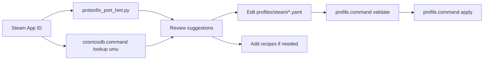

# Protonfixes → Cosmos Porting Guide

How to use [umu-protonfixes](https://github.com/Open-Wine-Components/umu-protonfixes)
and the [UMU database](https://umu.openwinecomponents.org/) as **reference only**
when improving Cosmos profiles and recipes.

## License rule

| Source | License | Cosmos policy |
| --- | --- | --- |
| umu-protonfixes / protonfixes | GPL-3.0 | Read fix **ideas**; reimplement as YAML + `.recipe` |
| UMU database API | GPL-3.0 data | Runtime lookup via `cosmosdb.command lookup <appid> umu` |
| macos-wine-steam configs | MIT | Safe to import via `scripts/import_macos_wine_steam.sh` |

**Never** copy Python fix scripts into this MIT repository.

## Workflow



### 1. Fetch port hints

```bash
./scripts/protonfix_port_hint.py 22380
./scripts/protonfix_port_hint.py 22380 --json
./cosmosdb.command lookup 22380 umu
```

The hint tool reports:

- `winetricks_verbs` → map to `recipes/dependencies/` IDs
- `environment` / `suggested_env` → `settings.env` in profiles
- `exe_replacements` → manual notes (Cosmos launches via Steam; exe swaps need mod tooling)
- `suggested_dependencies` → `dependencies:` list when recipes exist

### 2. Map winetricks verbs

| Protonfix verb | Cosmos recipe ID |
| --- | --- |
| `vcrun2010` | `vcrun2010` |
| `vcrun2015` | `vcrun2015` |
| `vcrun2019` | `vcrun2019` |
| `d3dx9` / `d3dx9_43` | `d3dx9` |
| `dotnet48` / `dotnet462` | `dotnet48` |
| `corefonts` / `allfonts` | `corefonts` |

Missing verbs: add a new `recipes/dependencies/<id>.recipe` or document manual winetricks in `notes`.

### 3. Apply to profile YAML

Example (Fallout: New Vegas — Bethesda protonfix exe swap reference):

```yaml
dependencies:
  - vcrun2010
  - d3dx9
notes: >
  Protonfix reference (GPL): swaps FalloutNV.exe for nvse_loader.exe when using
  NVSE. Install NVSE in the prefix and launch the loader for modded play.
```

Validate and apply:

```bash
./profile.command validate profiles/steam/steam-22380-fallout-new-vegas.yaml
./profile.command apply profiles/steam/steam-22380-fallout-new-vegas.yaml
```

### 4. macos-wine-steam presets (MIT)

```bash
./scripts/import_macos_wine_steam.sh --sync --write-drafts
./scripts/import_macos_wine_steam.sh --merge   # env/backend into existing profiles
```

## Pilot titles (Cosmos profiles)

| App ID | Game | Protonfix script | Action taken |
| --- | --- | --- | --- |
| 22380 | Fallout: New Vegas | `22380.py` → Bethesda exe swap | Notes + existing deps |
| 377160 | Fallout 4 | symlinked Bethesda fix | Notes |
| 489830 | Skyrim SE | symlinked Bethesda fix | Notes |
| 1091500 | Cyberpunk 2077 | none | UMU entry; d3dmetal profile |
| 1145360 | Hades | none | DXMT env tuning only |

## Related docs

- [PROFILE_FORMAT.md](PROFILE_FORMAT.md)
- [LUTRIS_MAPPING.md](LUTRIS_MAPPING.md)
- [ADOPTION_PLAN.md](ADOPTION_PLAN.md) Phase 4
- [LICENSING.md](LICENSING.md)
